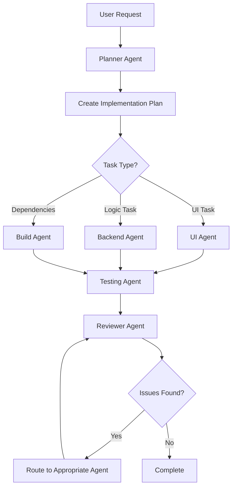

# Multi-Agent System for NovaChat

This repository uses a specialized multi-agent system with GitHub Copilot to prevent agent drift and maintain code quality across the Android project.

## Agent Overview

We have six specialized agents, each with specific responsibilities and constraints:

### 1. 🎯 Planner Agent (`planner.agent.md`)
**Role**: Analyzes requirements and creates implementation plans

**Responsibilities**:
- Break down features into actionable tasks
- Define architecture and component structure
- Create test strategies
- Set clear acceptance criteria

**Constraints**:
- Never implements code directly
- Only creates plans and specifications
- Always uses markdown checklists

**Handoffs**: Routes tasks to UI, Backend, or Build agents

---

### 2. 🎨 UI Agent (`ui-agent.agent.md`)
**Role**: Implements Android user interfaces

**Scope**:
- Layouts (XML)
- Activities and Fragments
- Resource files (strings, colors, dimensions)
- Material Design components
- ViewBinding setup

**Constraints**:
- ONLY modifies UI-related files
- Never implements business logic
- Must use ViewBinding (no findViewById)
- All strings must be in resources

**Handoffs**: To Backend (for ViewModel integration), Testing (for UI tests), or Reviewer

---

### 3. ⚙️ Backend Agent (`backend-agent.agent.md`)
**Role**: Implements business logic and data layer

**Scope**:
- ViewModels
- Repositories
- Data sources (Room, Retrofit)
- Use cases
- Dependency injection

**Constraints**:
- ONLY modifies backend/logic files
- Never modifies UI files
- ViewModels must not have UI references
- All logic must be unit testable

**Handoffs**: To UI (for integration), Testing (for unit tests), or Build (for dependencies)

---

### 4. 🧪 Testing Agent (`testing-agent.agent.md`)
**Role**: Writes comprehensive tests

**Scope**:
- Unit tests (ViewModels, repositories)
- Instrumentation tests (UI with Espresso)
- Test utilities and helpers

**Constraints**:
- ONLY creates or modifies test files
- Never modifies production code
- If tests fail, reports issues and hands off to appropriate agent

**Handoffs**: To Backend or UI (for bug fixes), Reviewer (for coverage review)

---

### 5. 🔧 Build Agent (`build-agent.agent.md`)
**Role**: Manages build configuration and dependencies

**Scope**:
- Gradle build files
- Dependency management
- Version catalogs
- ProGuard/R8 rules
- Build variants

**Constraints**:
- ONLY modifies build configuration files
- Never modifies application code
- Must check dependencies for security vulnerabilities
- No secrets in build files

**Handoffs**: To Backend (after adding dependencies), Testing (for test setup), or Reviewer

---

### 6. 👁️ Reviewer Agent (`reviewer-agent.agent.md`)
**Role**: Reviews code quality and security

**Responsibilities**:
- Code quality review
- Architecture compliance
- Security auditing
- Accessibility checking
- Performance analysis
- Test coverage review

**Constraints**:
- ONLY reviews - never implements fixes
- Must categorize issues by severity
- Provides specific, actionable feedback

**Handoffs**: Routes issues to appropriate agents for fixes

---

## Reusable Skills

Skills are shared knowledge that agents can reference:

### 📱 Android Testing Skill
Location: `.github/skills/android-testing/`

Provides:
- ViewModel unit testing patterns
- Espresso UI testing examples
- MockK best practices
- Test organization (AAA pattern)

### 🎨 Material Design 3 Skill
Location: `.github/skills/material-design/`

Provides:
- Material Design 3 component examples
- Theme configuration
- Layout best practices
- Accessibility guidelines

### 🔒 Security Best Practices Skill
Location: `.github/skills/security-check/`

Provides:
- Secure data storage patterns
- Network security configuration
- Input validation
- Permission handling
- Security checklist

---

## How to Use the Multi-Agent System

### Starting a New Feature

1. **Assign to Planner Agent**
   ```
   @copilot using planner.agent.md
   
   Create a plan for implementing [feature description]
   ```

2. **Planner creates detailed plan** with tasks assigned to specific agents

3. **Execute tasks** by invoking the assigned agents:
   ```
   @copilot using ui-agent.agent.md
   
   Implement the login screen layout according to the plan
   ```

4. **Agent completes work** and suggests handoff to next agent

5. **Continue the chain** until all tasks are complete

6. **Final review**:
   ```
   @copilot using reviewer-agent.agent.md
   
   Review the login feature implementation
   ```

### Example Workflow



## Anti-Drift Mechanisms

### 1. **Strict Scope Enforcement**
Each agent has explicit file scope constraints. Agents will refuse to work on files outside their scope.

### 2. **Handoff Protocols**
Agents clearly specify when to hand off to another agent, preventing scope creep.

### 3. **Boundary Checks**
Built-in checks prevent common mistakes:
- UI Agent refuses business logic
- Backend Agent refuses UI modifications
- Testing Agent never modifies production code

### 4. **Skills as Reference**
Shared skills provide consistent patterns, reducing variation in implementation.

### 5. **Reviewer Oversight**
Reviewer Agent catches drift before code is merged.

## Best Practices

### ✅ Do's

- Always start with Planner Agent for new features
- Use the appropriate specialized agent for each task
- Reference skills when implementing patterns
- Run Reviewer Agent before finalizing
- Follow handoff recommendations

### ❌ Don'ts

- Don't ask UI Agent to implement ViewModels
- Don't ask Backend Agent to create layouts
- Don't skip the planning phase
- Don't ignore handoff suggestions
- Don't bypass the review process

## Agent Invocation Examples

### Planning
```
@copilot using planner.agent.md

Plan implementation for:
- User authentication with email/password
- Remember me functionality
- Password reset flow
```

### UI Implementation
```
@copilot using ui-agent.agent.md

Create the login screen with:
- Email input field
- Password input field (masked)
- Login button
- Forgot password link
```

### Backend Implementation
```
@copilot using backend-agent.agent.md

Implement LoginViewModel with:
- Email and password validation
- Authentication state management
- Error handling
```

### Testing
```
@copilot using testing-agent.agent.md

Create tests for LoginViewModel covering:
- Successful login
- Invalid credentials
- Network errors
```

### Build Configuration
```
@copilot using build-agent.agent.md

Add dependencies for:
- Retrofit for networking
- Room for local storage
- Hilt for dependency injection
```

### Code Review
```
@copilot using reviewer-agent.agent.md

Review the authentication feature for:
- Security vulnerabilities
- Architecture compliance
- Test coverage
```

## Troubleshooting

### Agent Not Following Constraints?

1. Re-invoke with explicit scope reminder
2. Reference the agent file directly
3. Use Reviewer Agent to catch violations

### Confused About Which Agent to Use?

1. Start with Planner Agent
2. Let Planner recommend the right agent
3. Follow handoff suggestions

### Tests Failing After Implementation?

1. Invoke Testing Agent to analyze failures
2. Testing Agent will hand off to appropriate agent
3. Fix and re-test

## Directory Structure

```
.github/
├── agents/
│   ├── planner.agent.md
│   ├── ui-agent.agent.md
│   ├── backend-agent.agent.md
│   ├── testing-agent.agent.md
│   ├── build-agent.agent.md
│   └── reviewer-agent.agent.md
├── skills/
│   ├── android-testing/
│   │   └── SKILL.md
│   ├── material-design/
│   │   └── SKILL.md
│   └── security-check/
│       └── SKILL.md
└── copilot-instructions.md
```

## Contributing

When contributing to this project:

1. **Use the agent system** - don't bypass it
2. **Follow handoff protocols** - respect agent boundaries
3. **Update skills** - if you find better patterns
4. **Review before merge** - always use Reviewer Agent

## Additional Resources

- [GitHub Copilot Agent Documentation](https://docs.github.com/en/copilot/how-tos/use-copilot-agents)
- [Android Developer Guide](https://developer.android.com)
- [Material Design 3](https://m3.material.io)
- [OWASP Mobile Security](https://owasp.org/www-project-mobile-security-testing-guide/)
