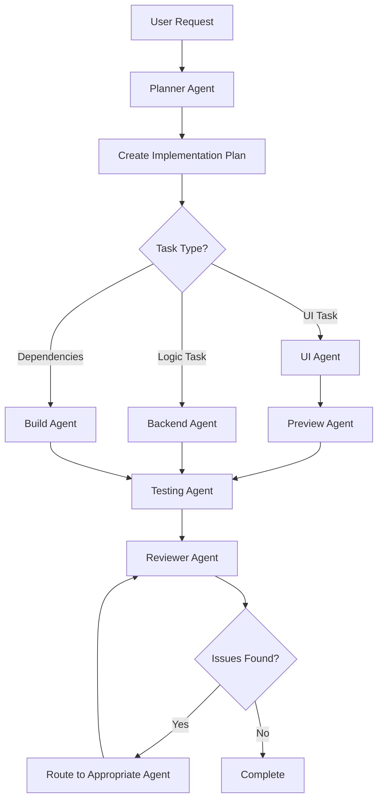

# Multi-Agent System for NovaChat

This repository uses a specialized multi-agent system with GitHub Copilot to prevent agent drift and maintain code quality across the Android project.

> **MANDATORY PROTOCOL**: All agents MUST follow [DEVELOPMENT_PROTOCOL.md](DEVELOPMENT_PROTOCOL.md)
>
> **Key Requirements for ALL Agents:**
>
> - **Zero-Elision Policy**: Never use placeholders (`// ... code`)
> - **Complete Implementations**: Write full, working code only
> - **Self-Validation**: Check completeness, imports, syntax before output
> - **Input Disambiguation**: Ask for clarification when requests are ambiguous
> - **Cross-File Dependencies**: Analyze ripple effects before changes (code + documentation + implicit references)
> - **Implicit Reference Checking**: When updating files, search for semantic synonyms and related concepts, not just exact name matches
> - **Atomic Processing**: One complete file at a time
> - **Source Verification**: Validate external versions against official sources only after asking which tool to use. Do not pick a tool unilaterally; use the user-selected tool for the full verification flow.
> - **2026 Standards**: Kotlin 2.2.21, AGP 9.0.0, Compose BOM 2026.01.01 (Google Maven only; [BOM mapping](https://developer.android.com/develop/ui/compose/bom/bom-mapping))

## Diff-Style Summary Format

When asked to summarize edits, use a diff-style summary with section-by-section bullets and cite file paths.
Prefer `git diff` when the user asks for exact change details.

Template:

```text
Diff-Style Summary
- Section: <what changed> (file: <path>)
- Section: <what changed> (file: <path>)
- Before → After: <short change> (file: <path>)
```

## Agent Overview

We have seven specialized agents, each with specific responsibilities and constraints:

### 1. Planner Agent ([`planner.agent.md`](agents/planner.agent.md))

**Role**: Analyzes requirements and creates implementation plans

**Responsibilities**:

- Break down features into actionable tasks
- Define architecture and component structure
- Create test strategies
- Set clear acceptance criteria

**Constraints**:

- Never implements code directly
- Only creates plans and specifications
- Always uses markdown checklists

**Handoffs**: Routes tasks to UI, Backend, or Build agents

---

### 2. UI Agent ([`ui-agent.agent.md`](agents/ui-agent.agent.md))

**Role**: Implements Jetpack Compose user interfaces

**Scope**:

- Jetpack Compose UI (Composables)
- Material Design 3 components
- Theme configuration
- Resource files (strings only)
- UI state management

**Constraints**:

- ONLY modifies UI-related files:
  - [`feature-ai/src/main/java/.../ui/`](../feature-ai/src/main/java/com/novachat/feature/ai/ui)
  - [`feature-ai/src/main/java/.../ui/theme/`](../feature-ai/src/main/java/com/novachat/feature/ai/ui/theme)
  - [`app/src/main/java/.../MainActivity.kt`](../app/src/main/java/com/novachat/app/MainActivity.kt)
  - [`app/src/main/res/values/strings.xml`](../app/src/main/res/values/strings.xml)
  - Not ViewModels or backend logic (see [`presentation/viewmodel/`](../feature-ai/src/main/java/com/novachat/feature/ai/presentation/viewmodel))
- Never implements business logic
- All UI in Compose (no XML layouts)
- All strings must be in resources
- **MUST provide complete Composable implementations**

**Protocol Requirements**:

- **Complete `@Composable` functions** (no `// ... UI implementation` placeholders)
- **All imports explicitly included**
- **Full theme integration shown**
- **Check existing Composables before creating new ones**

**Handoffs**: To Backend (for ViewModel integration), Testing (for UI tests), or Reviewer

---

### 3. Preview Agent ([`preview-agent.agent.md`](agents/preview-agent.agent.md))

**Role**: Creates comprehensive @Preview annotations and preview composables for IDE debugging

**Scope**:

- @Preview annotations on Composables ([`feature-ai/src/main/java/.../ui/`](../feature-ai/src/main/java/com/novachat/feature/ai/ui))
- Preview composition files (`*ScreenPreview.kt`) in [`feature-ai/src/main/java/.../ui/preview/`](../feature-ai/src/main/java/com/novachat/feature/ai/ui/preview)
- Preview data providers (`Preview*ScreenData`) in [`feature-ai/src/main/java/.../ui/preview/`](../feature-ai/src/main/java/com/novachat/feature/ai/ui/preview)
- Preview utilities and device specifications in [`feature-ai/src/main/java/.../ui/preview/`](../feature-ai/src/main/java/com/novachat/feature/ai/ui/preview)
- Multi-state/device/theme preview composition

**Constraints**:

- ONLY creates preview code (for IDE debugging, not production)
- Never calls production repositories
- No side effects in preview Composables
- Previews are driven by parameterized UI composables (no ViewModel usage)
- **MUST provide complete preview implementations**
- Lightweight theme variants for fast IDE compilation

**Protocol Requirements**:

- **Complete @Preview functions** (all states shown)
- **Multiple device variants for each preview**
- **Light and dark theme previews**
- **Mock data only** (no API calls)
- **All imports explicitly included**
- **Preview data helpers** (Preview*ScreenData) for state coverage

**Handoffs**: From UI (for new Composables) and Backend (for state changes), to Testing (for automated tests)

---

### 4. Backend Agent ([`backend-agent.agent.md`](agents/backend-agent.agent.md))

**Role**: Implements business logic, domain, and data layers, following Clean Architecture.

**Scope**:

- **Presentation Layer**: ViewModels (with StateFlow, UiState, UiEffect) in [`presentation/viewmodel/`](../feature-ai/src/main/java/com/novachat/feature/ai/presentation/viewmodel)
- **Domain Layer**: Core models, Repository interfaces, and Use Cases in [`domain/`](../feature-ai/src/main/java/com/novachat/feature/ai/domain)
- **Data Layer**: Repository implementations and data sources in [`data/`](../feature-ai/src/main/java/com/novachat/feature/ai/data)
- **Dependency Injection**: AiContainer in [`di/AiContainer.kt`](../feature-ai/src/main/java/com/novachat/feature/ai/di/AiContainer.kt)

**Constraints**:

- ONLY modifies backend/logic files:
  - [`feature-ai/src/main/java/.../data/`](../feature-ai/src/main/java/com/novachat/feature/ai/data)
  - [`feature-ai/src/main/java/.../domain/`](../feature-ai/src/main/java/com/novachat/feature/ai/domain)
  - [`feature-ai/src/main/java/.../presentation/model/`](../feature-ai/src/main/java/com/novachat/feature/ai/presentation/model)
  - [`feature-ai/src/main/java/.../presentation/viewmodel/`](../feature-ai/src/main/java/com/novachat/feature/ai/presentation/viewmodel)
  - [`feature-ai/src/main/java/.../di/`](../feature-ai/src/main/java/com/novachat/feature/ai/di)
- Never modifies UI files
- ViewModels must not have UI references
- All logic must be unit testable
- **MUST provide complete implementations**

**Protocol Requirements**:

- **Complete ViewModels with all state handling**
- **Complete Repository implementations** (no `// ... implement` placeholders)
- **All coroutine scopes and error handling included**
- **Verify existing implementations before adding new ones**

**Handoffs**: To UI (for integration), Testing (for unit tests), or Build (for dependencies)

---

### 5. Testing Agent ([`testing-agent.agent.md`](agents/testing-agent.agent.md))

**Role**: Writes comprehensive tests

**Scope**:

- Unit tests (ViewModels, repositories) with coroutines in [`feature-ai/src/test/java/`](../feature-ai/src/test/java) and [`app/src/test/java/`](../app/src/test/java)
- Compose UI tests (not Espresso) in [`feature-ai/src/androidTest/java/`](../feature-ai/src/androidTest/java) and [`app/src/androidTest/java/`](../app/src/androidTest/java)
- Test utilities and helpers in [`feature-ai/src/test/java/`](../feature-ai/src/test/java) and [`app/src/test/java/`](../app/src/test/java)

**Constraints**:

- ONLY creates or modifies test files
- Never modifies production code
- If tests fail, reports issues and hands off to appropriate agent
- **MUST provide complete test implementations**

**Protocol Requirements**:

- **Complete test functions** (no `// ... test implementation` placeholders)
- **All test setup and teardown included**
- **MockK setup fully shown**
- **ComposeTestRule usage complete**
- **Check for existing tests before creating duplicates**

**Handoffs**: To Backend or UI (for bug fixes), Reviewer (for coverage review)

---

### 6. Build Agent ([`build-agent.agent.md`](agents/build-agent.agent.md))

**Role**: Manages build configuration and dependencies

**Scope**:

- Gradle build files (Kotlin DSL) in [`build.gradle.kts`](../build.gradle.kts), [`app/build.gradle.kts`](../app/build.gradle.kts), [`feature-ai/build.gradle.kts`](../feature-ai/build.gradle.kts), [`core-common/build.gradle.kts`](../core-common/build.gradle.kts), and [`core-network/build.gradle.kts`](../core-network/build.gradle.kts)
- Dependency management (Compose BOM, AI SDKs) in [`feature-ai/build.gradle.kts`](../feature-ai/build.gradle.kts) and [`app/build.gradle.kts`](../app/build.gradle.kts)
- Version catalogs (if used; see [`gradle/`](../gradle))
- ProGuard/R8 rules in [`app/proguard-rules.pro`](../app/proguard-rules.pro)
- Build variants

**Constraints**:

- ONLY modifies build configuration files
- Never modifies application code
- Must check dependencies for security vulnerabilities using the user-selected verification tool (ask first; do not choose a tool unilaterally)
- No secrets in build files
- **MUST provide complete build configurations**

**Protocol Requirements**:

- **Complete build.gradle.kts files** (no `// ... dependencies` placeholders) in [`build.gradle.kts`](../build.gradle.kts), [`app/build.gradle.kts`](../app/build.gradle.kts), [`feature-ai/build.gradle.kts`](../feature-ai/build.gradle.kts), [`core-common/build.gradle.kts`](../core-common/build.gradle.kts), and [`core-network/build.gradle.kts`](../core-network/build.gradle.kts)
- **All plugin configurations shown**
- **Version catalog entries complete** (if used; see [`gradle/`](../gradle))
- **Verify 2026 dependency versions** (Compose BOM 2026.01.01, Kotlin 2.2.21) against official sources using the user-selected tool (ask first; do not choose a tool unilaterally)

**Handoffs**: To Backend (after adding dependencies), Testing (for test setup), or Reviewer

---

### 7. Reviewer Agent ([`reviewer-agent.agent.md`](agents/reviewer-agent.agent.md))

**Role**: Reviews code quality and security

**Responsibilities**:

- Code quality review
- Architecture compliance (MVVM + Clean Architecture)
- Security auditing
- Accessibility checking
- Performance analysis
- Test coverage review
- **DEVELOPMENT_PROTOCOL.md compliance**

**Constraints**:

- ONLY reviews - never implements fixes
- Must categorize issues by severity
- Provides specific, actionable feedback
- **MUST check for protocol violations**

**Protocol Requirements**:

- ✅ Verify zero-elision policy compliance (no placeholders in code)
- ✅ Check complete implementations
- ✅ Verify all imports present
- ✅ Check syntax correctness
- ✅ Validate 2026 standards usage
- ✅ Identify cross-file dependency issues

**Handoffs**: Routes issues to appropriate agents for fixes

---

## Constraints Cross-Check (Repo Paths)

Validated against the current repository layout:

- **Planner Agent**: No file modifications.
- **Reviewer Agent**: No file modifications.
- **UI Agent**:
  - [`feature-ai/src/main/java/com/novachat/feature/ai/ui/**`](../feature-ai/src/main/java/com/novachat/feature/ai/ui)
  - [`feature-ai/src/main/java/com/novachat/feature/ai/ui/theme/**`](../feature-ai/src/main/java/com/novachat/feature/ai/ui/theme)
  - [`app/src/main/java/com/novachat/app/MainActivity.kt`](../app/src/main/java/com/novachat/app/MainActivity.kt)
  - [`app/src/main/res/values/strings.xml`](../app/src/main/res/values/strings.xml)
- **Preview Agent**: [`feature-ai/src/main/java/com/novachat/feature/ai/ui/preview/**`](../feature-ai/src/main/java/com/novachat/feature/ai/ui/preview)
- **Backend Agent**:
  - [`feature-ai/src/main/java/com/novachat/feature/ai/presentation/model/**`](../feature-ai/src/main/java/com/novachat/feature/ai/presentation/model)
  - [`feature-ai/src/main/java/com/novachat/feature/ai/presentation/viewmodel/**`](../feature-ai/src/main/java/com/novachat/feature/ai/presentation/viewmodel)
  - [`feature-ai/src/main/java/com/novachat/feature/ai/domain/**`](../feature-ai/src/main/java/com/novachat/feature/ai/domain)
  - [`feature-ai/src/main/java/com/novachat/feature/ai/data/**`](../feature-ai/src/main/java/com/novachat/feature/ai/data)
  - [`feature-ai/src/main/java/com/novachat/feature/ai/di/**`](../feature-ai/src/main/java/com/novachat/feature/ai/di)
  - [`app/src/main/java/com/novachat/app/NovaChatApplication.kt`](../app/src/main/java/com/novachat/app/NovaChatApplication.kt)
- **Testing Agent**:
  - [`feature-ai/src/test/java/**`](../feature-ai/src/test/java)
  - [`feature-ai/src/androidTest/java/**`](../feature-ai/src/androidTest/java)
  - [`app/src/test/java/**`](../app/src/test/java)
  - [`app/src/androidTest/java/**`](../app/src/androidTest/java)
- **Build Agent**:
  - [`build.gradle.kts`](../build.gradle.kts)
  - [`app/build.gradle.kts`](../app/build.gradle.kts)
  - [`settings.gradle.kts`](../settings.gradle.kts)
  - [`gradle.properties`](../gradle.properties)
  - [`gradle/wrapper/gradle-wrapper.properties`](../gradle/wrapper/gradle-wrapper.properties)
  - [`app/proguard-rules.pro`](../app/proguard-rules.pro)
  - [`app/src/main/AndroidManifest.xml`](../app/src/main/AndroidManifest.xml)

If any path moves, update this section and the agent constraints together.

## Reusable Skills

Skills are shared knowledge that agents can reference. **All skills MUST follow DEVELOPMENT_PROTOCOL.md** (no placeholder code).

### 📱 Android Testing Skill

Location: [`.github/skills/android-testing/`](skills/android-testing)

Provides:

- ViewModel unit testing with coroutines (complete examples)
- Compose UI testing with ComposeTestRule
- MockK best practices (full setup shown)
- Test organization (AAA pattern with complete tests)

**Protocol**: All test examples are complete and runnable

### Material Design 3 Skill

Location: [`.github/skills/material-design/`](skills/material-design)

Provides:

- Material Design 3 Compose components (complete implementations)
- Theme configuration (full theme files)
- Layout best practices (complete Composables)
- Accessibility guidelines

**Protocol**: All Compose examples are complete and functional

### Compose Preview Skill

Location: [`.github/skills/compose-preview/`](skills/compose-preview)

Provides:

- Best practices for `@Preview` annotations
- Multi-preview annotations for device and theme variations
- Creation of mock data providers (e.g., Preview*Data)
- Techniques for isolating previews from ViewModels

**Protocol**: All preview examples are complete and functional

### Security Best Practices Skill

Location: [`.github/skills/security-check/`](skills/security-check)

Provides:

- Secure data storage patterns (complete DataStore implementations)
- Network security configuration (full XML configs)
- Input validation (complete validation functions)
- Permission handling (complete runtime permission code)
- Security checklist

**Protocol**: All security examples are complete implementations

### Cursor Browser Skill

Location: [`.github/skills/cursor-browser/`](skills/cursor-browser)

Provides:

- Use when the user selects Cursor's built-in browser for web content retrieval and verification
- Browser automation (navigate, snapshot, click, fill, form submit)
- Verifying external docs (AGP release notes, Compose BOM, OWASP, etc.)
- Multi-step flows, form filling, dynamic content

**Protocol**: Use `browser_navigate` → `browser_snapshot` → interact with refs; re-snapshot after DOM changes

### GitKraken MCP Skill

Location: [`.github/skills/gitkraken-mcp/`](skills/gitkraken-mcp)

Provides:

- **Git context** – git_status, git_log_or_diff, git_blame
- **Branch management** – git_branch, git_checkout
- **PR/issue context** – pull_request_get_detail, issues_assigned_to_me, issues_get_detail
- **Workflow** – git_add_or_commit, git_push, git_stash (when approved)

**Protocol**: Reviewer/Planner use read-only; implementation agents use for context; commit/push only when explicitly requested

### Pieces MCP Skill

Location: [`.github/skills/pieces-mcp/`](skills/pieces-mcp)

Provides:

- **Find older edits** – `ask_pieces_ltm` queries Long-Term Memory for edits from other IDEs
- **Cross-session context** – Previous implementations, decisions, notes
- **Avoid rework** – Check LTM before reimplementing; find forgotten changes

**Protocol**: Use when something might exist in LTM but not in current repo; PiecesOS + LTM must be running

---

## How to Use the Multi-Agent System

### Starting a New Feature

1. **Assign to Planner Agent**

   Use [`agents/planner.agent.md`](agents/planner.agent.md)

   ```markdown
   @copilot using planner.agent.md
   
   Create a plan for implementing [feature description]
   ```

2. **Planner creates detailed plan** with tasks assigned to specific agents

3. **Execute tasks** by invoking the assigned agents:

   Use [`agents/ui-agent.agent.md`](agents/ui-agent.agent.md)

   ```markdown
   @copilot using ui-agent.agent.md
   
   Implement the login screen layout according to the plan
   ```

4. **Agent completes work** and suggests handoff to next agent

5. **Continue the chain** until all tasks are complete

6. **Final review**:

   Use [`agents/reviewer-agent.agent.md`](agents/reviewer-agent.agent.md)

   ```markdown
   @copilot using reviewer-agent.agent.md
   
   Review the login feature implementation
   ```

### Example Workflow



## Anti-Drift Mechanisms

### 1. **Strict Scope Enforcement**

Each agent has explicit file scope constraints. Agents will refuse to work on files outside their scope.

### 2. **Handoff Protocols**

Agents clearly specify when to hand off to another agent, preventing scope creep.

### 3. **Boundary Checks**

Built-in checks prevent common mistakes:

- UI Agent refuses business logic
- Backend Agent refuses UI modifications
- Testing Agent never modifies production code

### 4. **Skills as Reference**

Shared skills provide consistent patterns, reducing variation in implementation.

### 5. **Reviewer Oversight**

Reviewer Agent catches drift before code is merged.

### Best Practices

#### Do's

- Always start with Planner Agent for new features
- Use the appropriate specialized agent for each task
- Reference skills when implementing patterns
- Run Reviewer Agent before finalizing
- Follow handoff recommendations

#### Don'ts

- Don't ask UI Agent to implement ViewModels
- Don't ask Backend Agent to create layouts
- Don't skip the planning phase
- Don't ignore handoff suggestions
- Don't bypass the review process

## Agent Invocation Examples

### Planning

Use [`agents/planner.agent.md`](agents/planner.agent.md)

```bash
@copilot using planner.agent.md

Plan implementation for:
- User authentication with email/password
- Remember me functionality
- Password reset flow
```

### UI Implementation

Use [`agents/ui-agent.agent.md`](agents/ui-agent.agent.md)

```bash
@copilot using ui-agent.agent.md

Create the login screen with:
- Email input field
- Password input field (masked)
- Login button
- Forgot password link
```

### Backend Implementation

Use [`agents/backend-agent.agent.md`](agents/backend-agent.agent.md)

```bash
@copilot using backend-agent.agent.md

Implement LoginViewModel with:
- Email and password validation
- Authentication state management
- Error handling
```

### Testing

Use [`agents/testing-agent.agent.md`](agents/testing-agent.agent.md)

```bash
@copilot using testing-agent.agent.md

Create tests for LoginViewModel covering:
- Successful login
- Invalid credentials
- Network errors
```

### Build Configuration

Use [`agents/build-agent.agent.md`](agents/build-agent.agent.md)

```bash
@copilot using build-agent.agent.md

Add dependencies for:
- Retrofit for networking
- Room for local storage
- Hilt for dependency injection
```

### Code Review

Use [`agents/reviewer-agent.agent.md`](agents/reviewer-agent.agent.md)

```bash
@copilot using reviewer-agent.agent.md

Review the authentication feature for:
- Security vulnerabilities
- Architecture compliance
- Test coverage
```

## Troubleshooting

### Agent Not Following Constraints?

1. Re-invoke with explicit scope reminder
2. Reference the agent file directly
3. Use Reviewer Agent to catch violations

### Confused About Which Agent to Use?

1. Start with Planner Agent
2. Let Planner recommend the right agent
3. Follow handoff suggestions

### Tests Failing After Implementation?

1. Invoke Testing Agent to analyze failures
2. Testing Agent will hand off to appropriate agent
3. Fix and re-test

## Directory Structure

```text
.github/
├── agents/
│   ├── planner.agent.md
│   ├── ui-agent.agent.md
│   ├── preview-agent.agent.md
│   ├── backend-agent.agent.md
│   ├── testing-agent.agent.md
│   ├── build-agent.agent.md
│   └── reviewer-agent.agent.md
├── skills/
│   ├── android-testing/
│   │   └── SKILL.md
│   ├── material-design/
│   │   └── SKILL.md
│   ├── compose-preview/
│   │   └── SKILL.md
│   ├── security-check/
│   │   └── SKILL.md
│   ├── cursor-browser/
│   │   └── SKILL.md
│   ├── gitkraken-mcp/
│   │   └── SKILL.md
│   └── pieces-mcp/
│       └── SKILL.md
└── copilot-instructions.md
```

Linked paths:

- [`.github/agents/`](agents)
- [`.github/skills/`](skills)
- [`.github/copilot-instructions.md`](copilot-instructions.md)

## Contributing

When contributing to this project:

1. **Read DEVELOPMENT_PROTOCOL.md FIRST** - Mandatory for all development
2. **Use the agent system** - don't bypass it
3. **Follow handoff protocols** - respect agent boundaries
4. **Update skills** - if you find better patterns
5. **Review before merge** - always use Reviewer Agent

### Protocol Compliance

All contributions MUST comply with [DEVELOPMENT_PROTOCOL.md](DEVELOPMENT_PROTOCOL.md):

- **No placeholders**: Complete implementations only
- **Self-validation**: Check completeness, imports, syntax
- **Input disambiguation**: Ask when requests are unclear
- **Cross-file analysis**: Identify and update dependencies
- **Atomic processing**: One complete file at a time
- **2026 standards**: Latest Kotlin, AGP, Compose versions

### Enforcement

**All agents automatically enforce protocol compliance.** Violations will be rejected:

- Code with `// ... rest of implementation` → REJECTED
- Missing imports → REJECTED
- Incomplete implementations → REJECTED
- Outdated dependencies (pre-2026) → REJECTED

## Additional Resources

- **[DEVELOPMENT_PROTOCOL.md](DEVELOPMENT_PROTOCOL.md)** - **MANDATORY READING**
- [GitHub Copilot Agent Documentation](https://docs.github.com/en/copilot/how-tos/use-copilot-agents)
- [Android Developer Guide](https://developer.android.com)
- [Material Design 3](https://m3.material.io)
- [OWASP Mobile Security](https://owasp.org/www-project-mobile-security-testing-guide/)
